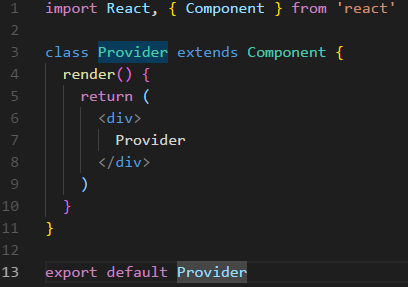
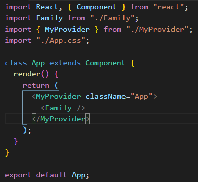
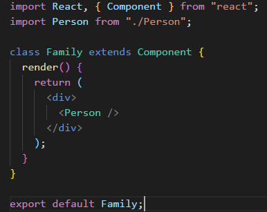
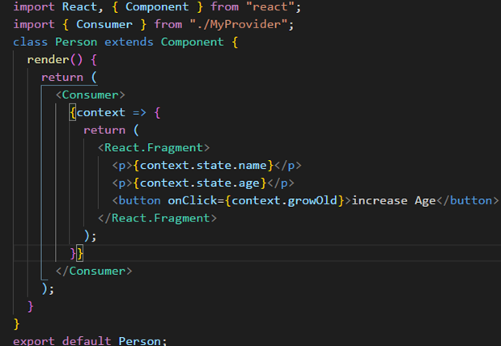

# React Context API

According to React official Docs The React Context api facilitates the developer to pass data through the component tree without having to pass props down manually at every level. [https://reactjs.org/docs/context.html] Context is basically used when the data is accessible by many components. It came with react 16.3
The typical React App the data flow works as top-down through props let’s say if App that displays the name of the person

**App Component**

```
import React, { Component } from "react";
import Person from "./Person";
import "./App.css";

class App extends Component {
  state = {
    name: "yasir",
    age: 33,
  };
  render() {
    return (
      <div className="App">
        <Person name={`My Name is ${this.state.name}`} />
      </div>
    );
  }
}

export default App;
```

**Person Component**

```
import React, { Component } from "react";
class Person extends Component {
  render() {
    return (
      <div>
        <p>{this.props.name}</p>
      </div>
    );
  }
}
export default Person;
```

**App Component** renders the **Person Component** which displays the name. Since name lives in **App Component** as the state. In React we can transfer state to the component as props. In order to pass the name down to **Person component** we will edit the code as follow

```
<Person name={`My Name is ${this.state.name}`} />
```

The Person Component will receive the name as props and displays it to the browser.
Lets add one more component naming **Family**

Let the App component render the Family Component and Family Component renders the Person component. Component tree will be like this


Now in order to display the person's name which lives as state in **App component**, the name will be pass down as props from **App component** to **Family component** and **Family component** will pass down the props to the **Person component**. The **Person component** will finally receives the name props and displays it to the browser.

This approach is fine if app is smaller and one doesn’t need to drill down props further than 2nd or 3rd levels. It gets messier and harder to track the data when app goes beyond 2nd or 3rd levels and that’s when one goes for state management tools such as **Redux** or **Mobx** where the data lives in store and it is centralized and can be injected to component at any level deep. **React Context API** does the similar job. It contains two important parts

- Provider (is where our data lives)
- Consumer (is where the data to be accessed )

## Configuring Context API

**Step1:** Create a **MyProvider Component** where our data would be placed



**Step2:** Create the Context

```
const MyContext = React.createContext();
```

**Step3:** Make sure **MyProvider Component** must return the `MyContext`, that we have created and inside the `MyContext` it will return `{this.props.children}`.

```
    return (
      <MyContext.Provider value={''}>
        {this.props.children}
      </MyContext.Provider>
    )
```

**Step4:** Create the state in the **MyProvider Component** and place into a value prop of `<MyContext.Provider />`

**State**

```
state = {
    name: "yasir",
    age: 33,
  };
```

Now **MyProvider Component** code will look as

```
import React, { Component } from 'react'

const MyContext = React.createContext();

export class Provider extends Component {
  state = {
    name: "yasir",
    age: 100,
    cool: true
  };

  render() {
    return (
      <MyContext.Provider value={this.state}>
        {this.props.children}
      </MyContext.Provider>
    )
  }
}
export Consumer = MyContext.Consumer
```

**Step5:** Our **MyProvider Component** will always live at top of the app, to make it happen we will import the **MyProvider Component** inside **App Component** and will be wrapit by **MyProvider Component** as shown in below



**Family Component Code**



**Step6:** Person Component will consume the state so lets configure it by importing `Consumer` from `./MyProvider` and in return the jsx will be wrapped by `<Consumer />` as shown in code below



**Step7:** Finally update the **MyProvider Component** code by adding a Function that updates the age of the person. The Function will be passed same as the state in the value prop. As shown in below

**MyProvider Code**

```
import React, { Component } from "react";

const MyContext = React.createContext();

export class MyProvider extends Component {
  state = {
    name: "Yasir",
    age: 33,

  };

  growOld = () => {
    this.setState({
      age: this.state.age + 1
    });
  };
  render() {
    return (
      <MyContext.Provider
        value={{
          state: this.state,
          growOld: this.growOld
        }}
      >
        {this.props.children}
      </MyContext.Provider>
    );
  }
}

export const Consumer = MyContext.Consumer;
```

for further details clone the repository

**Thanks :) & Peace**
