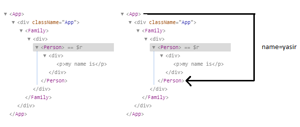

## React Context Api

According to React official Docs The React Context api facilitates the developer to pass data through the component tree without having to pass props down manually at every level. [https://reactjs.org/docs/context.html] Context is basically used when the data is accessible by many components. It came with react 16.3
The typical React App the data flow works as top-down through props let’s say if App that displays the name of the person

**App.js**

```
import React, { Component } from "react";
import Person from "./Person";
import "./App.css";

class App extends Component {
  state = {
    name: "yasir",
    age: 100,
    cool: true
  };
  render() {
    return (
      <div className="App">
        <Person name={`My Name is ${this.state.name}`} />
      </div>
    );
  }
}

export default App;
```

**Person.js**

```
import React, { Component } from "react";
class Person extends Component {
  render() {
    return (
      <div>
        <p>{this.props.name}</p>
      </div>
    );
  }
}
export default Person;
```

**App Component** renders the **Person Component** which displays the name. Since name lives in **App Component** as the state. In React we can transfer state to the component as props. In order to pass the name down to **Person component** we will edit the code as follow

```
<Person name={`My Name is ${this.state.name}`} />
```

The Person Component will receive the name as props and displays it to the browser.
Lets add one more component naming **Family**

Let the App component render the Family Component and Family Component renders the Person component. Component tree will be like this


